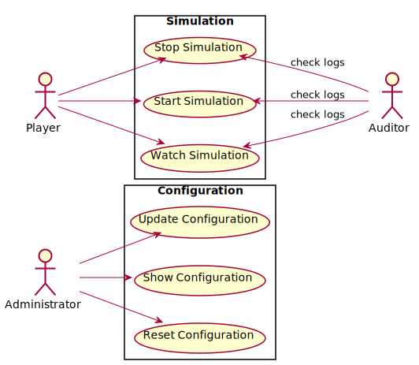

# Iteration 1

For the first iteration, the application will be a very simple simulation, stripped to the bare bones as far as fancy stuff like graphics or algorithms are concerned: the focus here should just be on architectural structure.


## Business requirements

The application needs to simulate a ball bouncing on the floor:
- the ball is rigid and unconstrained
- the ball is subjected to constant gravity
- the floor is horizontal, fixed and rigid
- the floor is placed below the ball (with respect to gravity)
- the ball is perfectly elastic

This should capture the simplest possible simulation of a ball bouncing.

The ball needs to be rigid, so no deformation will need to be taken into account (elasticity is simulated theoretically).

The only force acting on the ball is gravity, meaning that the ball will just move vertically: this means that it's irrelevant if the simulation is in 1, 2 or 3 dimensions.

The floor is horizontal in the sense that it applies to the ball a reaction force that has same direction and opposite orientation than gravity.

Of course the floor must be below the ball, otherwise the ball would fall indefinitely.

The ball is perfectly elastic, so it will return at the same height as where it started falling, with respect to the floor.


### Nice to have

For future iterations, we might want to add the ability to store configuration values that the simulation depends on, like the height of the ball, or the value of gravity. These configuration values should be changeable (but just when the simulation is not running), and it should be possible to reset them to the original values.

Additionally, we want to be able to run the simulation in debug mode, where comprehensive logs of every simulation step is recorded. When the simulation is not running in debug mode, only warning, error and critical level logs are written.


## Actors and use cases

Let's ignore the business model for now, and focus on the application. If we succeed in decoupling the domain layer from the application and infrastructure, we'll be able to implement the domain model without having to change application decisions too much anyway.

### Player

The first actor is the Player, who for now just starts, stops and "watches" the simulation. This is already an interesting situation, because usually we would think that the Start Simulation use case would automatically respond with some kind of output where the Player can watch the simulation. However, we could try to keep the Watch Simulation use case separated from the other two.

To do this, we can remember that input devices are generally different from output devices, at least in principle, and thus the application should keep the two separated, meaning that the output should be available in a different "channel" than the input. Then, if we are using a device that is capable of handling both input and output, like a GUI or console, its adapter will have to do what is required to correctly wire input and output to the two separate application use cases.

This is not much different than the CQRS approach used in business applications, where a command input doesn't return any meaningful output, and if you want to see how the state has changed after the command, you should issue the proper query.

In our case, we can think that the output is always available through some kind of "channel", and then the user can "connect" to that channel when he wants to check the output. Thus, the Start Simulation use case will just let the simulation begin, without returning any kind of output. After having started the simulation, the user should perform the Watch Simulation use case to connect to the output stream containing the simulation data that is being generated. Of course the Stop Simulation use case will end the simulation, and stop the data flux as well.

```gherkin
Feature: Simulation
    As a Player
    I want to run the simulation
    In order to watch it
    
    Scenario: Watching stopped simulation
        Given the simulation is stopped
        When I watch the simulation
        Then I get an error message for watching stopped simulation
        
    Scenario: Start the simulation
        Given the simulation is stopped
        When I start the simulation
        And I watch the simulation
        Then I don't get any error message
        
    Scenario: Starting started simulation
        Given the simulation is started
        When I start the simulation
        Then I get an error message for starting started simulation
        
    Scenario: Watch the simulation
        Given the simulation is started
        When I watch the simulation
        Then I get the stream of data of the simulation
        
    Scenario: Stop the simulation
        Given the simulation is started
        When I stop the simulation
        And I watch the simulation
        Then I get an error message for watching stopped simulation
        
    Scenario: Stopping stopped simulation
        Given the simulation is stopped
        When I stop the simulation
        Then I get an error message for stopping stopped simulation
```

Here we've decided that the application would throw an error when trying to watch a stopped simulation. Alternatively, we could add another use case like Check Simulation State, but this is not part of the business requirements: it would only be a way to simplify the design. 


### Developer

Regarding logging, the Developer actor is the one interested in checking logs, and running the simulation in debug mode. As far as use cases are concerned, for the Developer they are basically the same as the Player, but instead of checking some kind of output, we verify that logs are written.

```gherkin
Feature: Basic logging
    As a Developer
    I want to check basic logs
    In order to check if any error happened in the application
    
    Scenario: Warning log watching stopped simulation
        Given the simulation is stopped
        When I watch the simulation
        Then a warning log is written for watching stopped simulation
        
    Scenario: Warning log starting started simulation
        Given the simulation is started
        When I start the simulation
        Then a warning log is written for starting started simulation
        
    Scenario: Warning log stopping stopped simulation
        Given the simulation is stopped
        When I stop the simulation
        Then a warning log is written for stopping stopped simulation
        
    Scenario: No log starting simulation
        Given the simulation is stopped
        When I start the simulation
        Then no log is written
        
    Scenario: No log watching simulation
        Given the simulation is started
        When I watch the simulation
        Then no log is written
        
    Scenario: No log stopping simulation
        Given the simulation is started
        When I stop the simulation
        Then no log is written

Feature: Debug logging
    As a Developer
    I want to check debug logs
    In order to verify that the application is working properly
    
    Scenario: Info log starting simulation
        Given the simulation is stopped
        When I start the simulation
        Then an info log is written for starting simulation
        
    Scenario: Info log stopping simulation
        Given the simulation is started
        When I stop the simulation
        Then an info log is written for stopping simulation
        
    Scenario: Debug log for simulation steps
        Given the simulation is stopped
        When I start the simulation
        Then debug logs are written for each simulation step
```


### Administrator

Another role that might be needed is that of the Administrator, that will be able to set configuration values for the simulation. Here the use cases will generically be Show Configuration, Update Configuration and Reset Configuration:

```gherkin
Feature: Configuration
    As an Administrator
    I want to set the configuration
    In order to tweak the way the simulation works
    
    Scenario Outline: Show configuration
        When I show the value of configuration <conf>
        Then the value <value> is displayed
        
        Examples:
            | conf        | value |
            | ball-height | 10    |
            | gravity     | 9.81  |
    
    Scenario Outline: Update configuration
        Given the value of configuration <conf> is <value>
        When I update the configuration <conf> with <new>
        And I show the value of configuration <conf>
        Then the value <new> is displayed
        
        Examples:
            | conf        | value | new |
            | ball-height | 10    | 20  |
            | gravity     | 9.81  | 5.3 |
    
    Scenario Outline: Reset configuration
        Given the value of configuration <conf> is <value>
        And I update the configuration <conf> with <new>
        When I reset the configuration
        And I show the value of configuration <conf>
        Then the value <value> is displayed
        
        Examples:
            | conf        | value | new |
            | ball-height | 10    | 20  |
            | gravity     | 9.81  | 5.3 |
```

